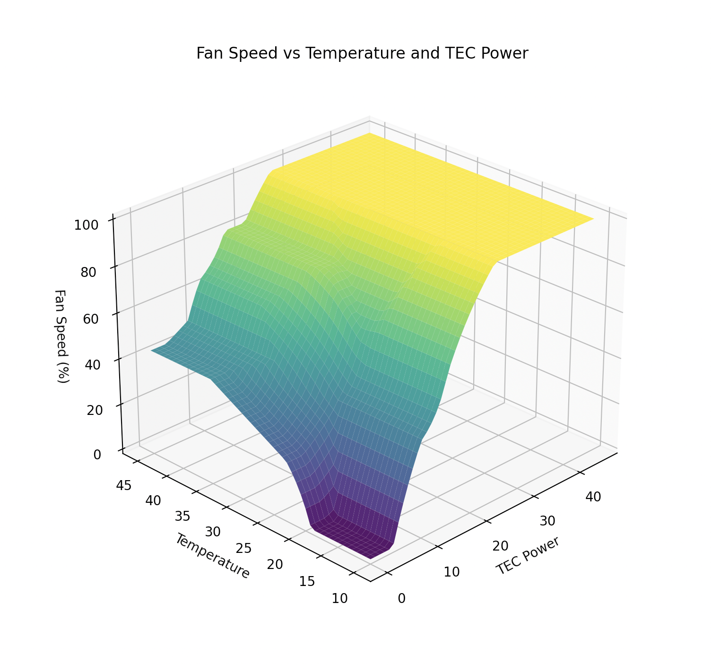

<p align="center">
    <picture>
        <source media="(prefers-color-scheme: dark)" srcset="./assets/SVG/Dark-Logo.svg">
        <source media="(prefers-color-scheme: light)" srcset="./assets/SVG/Bright-Logo.svg">
        
    </picture>
</p>

# Fuzzy Logic in C

A [fuzzy logic](https://en.wikipedia.org/wiki/Fuzzy_logic) Mamdani-like implementation in C.
This code implements the classification of crisp values to fuzzy sets and provides a basic inference engine based off of pre-defined rules.
Sets can then be de-fuzzified back to a crisp value.

Currently, Triangles, Trapezoids and Rectangular membership functions are supported.
Deffuzification is done using centroids.

## features

- Easy to get started
- extendable Membership Function States
- No dependencies (except for stdlib)
- Semantic natural language-like syntax for rule definitions

```C
// define membership functions
#define InputMembershipFunctions(X)                                            \
    X(INPUT_LOW, 0.0, 0.0, 15.0, 40.0, TRAPEZOIDAL)                            \
    X(INPUT_MEDIUM, 15.0, 40.0, 60.0, 80.0, TRAPEZOIDAL)                       \
    X(INPUT_HIGH, 60.0, 80.0, 100.0, 100.0, TRAPEZOIDAL)
DEFINE_FUZZY_MEMBERSHIP(InputMembershipFunctions)

// define the system rules
FuzzyRule rules[] = {
    // if input is low then output is high
    PROPOSITION(WHEN(ALL_OF(VAR(Input, INPUT_LOW))), THEN(Output, OUTPUT_HIGH)),

    // if input is not low then output is low
    PROPOSITION(WHEN(ALL_OF(NOT(Input, INPUT_LOW))), THEN(Output, OUTPUT_LOW)),
};
```

## example

Find working examples in the `./example` directory:
```bash
cd example
make all
#then run
./out/minimal
#and
./out/TecFanController
```
```
Usage: ./out/minmal <value>
Usage: ./out/TecFanControl <currentTemperature> <currentTemperatureChange> <currentTECPower> <currentFan>
```
You can then plot a simple surface of the fan controller example using the provided python script:
```bash
python -m venv ./venv
source ./venv/bin/activate
pip install -r requirements.txt
python ./plot.py
```
> [!NOTE]
> This visualization does not represent the entire controller due to its non-linear behavior.
> To fully represent this model you need a five-dimensional vector space.
> 

## legal

Licensed under the Apache License, Version 2.0 (the "License"); <br>
See [LICENSE.txt](LICENSE.txt) file for details.
