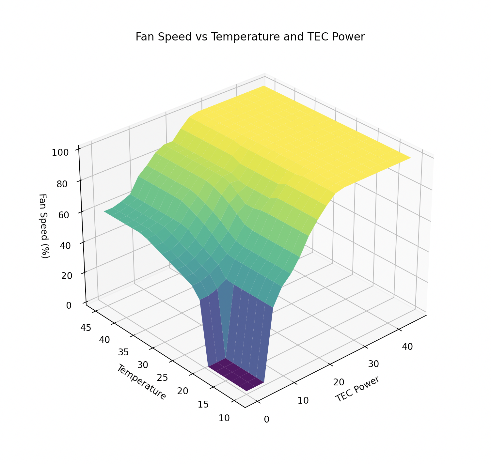

# Fuzzy C

A [fuzzy logic](https://en.wikipedia.org/wiki/Fuzzy_logic) Mamdani-like implementation in C.
This code implements the classification of crisp values to fuzzy sets and provides a basic inference engine based off of pre-defined rules.
Sets can then be de-fuzzified back to a crisp value.

Currently, Triangles, Trapezoids and Rectangular membership functions are supported.
Deffuzification is done using centroids.

## example

Find a working example in the `./example` directory:
```bash
cd example
make
./out/TecFanController
```
```
Usage: ./out/TecFanControl <currentTemperature> <currentTemperatureChange> <currentTECPower> <currentFan>
```
You can then plot a simple surface of the controller using the provided python script:
```bash
python -m venv ./venv
source ./venv/bin/activate
pip install -r requirements.txt
python ./plot.py
```
>! Note this does not represent the entire controller due to its non-linear behavior.


## legal

Licensed under the Apache License, Version 2.0 (the "License"); <br>
See [LICENSE.txt](LICENSE.txt) file for details.
